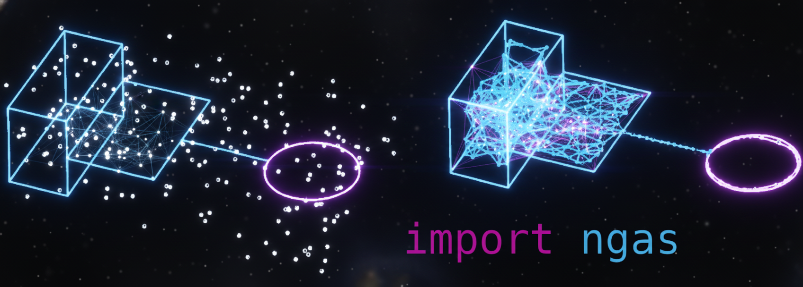

# ngas-pytorch

<p align="center">
  
</p>

PyTorch implementations of Neural Gas variants, including classical online models and differentiable models.

## Overview

This repository provides five supported models:

- `NeuralGas`: classical online Neural Gas with exponential rank neighborhood
- `InverseNeuralGas`: online Neural Gas with inverse squared-rank neighborhood
- `GrowingNeuralGas`: classical online GNG with explicit node insertion
- `DifferentiableNeuralGas`: differentiable Neural Gas objective optimized by backpropagation
- `DifferentiableGrowingNeuralGas`: differentiable GNG-style model with learnable topology and explicit `grow()`

## Install

```bash
pip install -e .
```

The example notebooks install `matplotlib` inside notebook cells so plotting stays out of the base package dependencies.

## Quickstart

Classical online family:

```python
import torch
from ngas.models import GrowingNeuralGas, InverseNeuralGas, NeuralGas

x = torch.randn(128, 2)

ng = NeuralGas(n_neurons=10, lr=0.02, max_edge_age=100, distance="l2")
ng.fit(x, epochs=5)
print(ng.weights.shape)
print(ng.quantization_error(x))

seed_points = x[:10]
ng_seeded = NeuralGas(
    n_neurons=10,
    max_edge_age=100,
    distance="l2",
    init_points=seed_points,
)

inv = InverseNeuralGas(n_neurons=10, lr=0.02, max_edge_age=100, distance="l2")
inv.fit(x, epochs=5)

gng = GrowingNeuralGas(max_neurons=32, lambda_steps=50, max_edge_age=100, distance="l2")
gng.fit(x, epochs=3)
print(gng.weights.shape)
```

Differentiable family (`nn.Module` style with external optimizer):

```python
import torch
from ngas.models import DifferentiableGrowingNeuralGas, DifferentiableNeuralGas

x = torch.randn(256, 2)

dng = DifferentiableNeuralGas(n_neurons=24, input_dim=2)
opt = torch.optim.Adam(dng.parameters(), lr=0.03)
for _ in range(100):
    opt.zero_grad()
    loss = dng(x)  # forward returns scalar loss
    loss.backward()
    opt.step()

dgng = DifferentiableGrowingNeuralGas(max_neurons=32, input_dim=2, init_neurons=4)
opt2 = torch.optim.Adam(dgng.parameters(), lr=0.02)
for _ in range(50):
    opt2.zero_grad()
    loss = dgng(x)
    loss.backward()
    opt2.step()
dgng.grow(n_new=2)

seed_points = x[:6]
dgng_seeded = DifferentiableGrowingNeuralGas(
    max_neurons=32,
    init_points=seed_points,
)
```

## API Notes

Common convenience methods across families:

- `predict(data)` for winner assignments
- `quantization_error(data)` for compact quality tracking

All five models are exported from both `ngas.models` and top-level `ngas`.

All five models also support optional constructor-time initialization from data:

- `init_points` accepts a tensor of starting neuron locations
- fixed-size models require exactly one point per neuron
- growing models start with all provided points active and may still grow later up to `max_neurons`
- if `init_points` is omitted, current random / lazy initialization behavior is preserved

The model families intentionally differ in training style:

- Classical family (`NeuralGas`, `InverseNeuralGas`, `GrowingNeuralGas`):
  - online explicit updates
  - `fit(...)` and `update(sample)` workflow
  - graph/topology update happens during sample updates
- Differentiable family (`DifferentiableNeuralGas`, `DifferentiableGrowingNeuralGas`):
  - `nn.Module` + gradient descent workflow
  - `forward(data)` returns scalar loss
  - `forward(data, return_details=True)` returns diagnostics
  - `DifferentiableGrowingNeuralGas.grow(...)` performs explicit structural growth

## Distances

Supported distance names:

- `"l2"` (alias: `"euclidean"`)
- `"sq_l2"` (alias: `"sqeuclidean"`)
- `"cosine"` (alias: `"cos"`)

Helpers are available at top-level:

```python
from ngas import SUPPORTED_DISTANCES, normalize_distance_name, pairwise_distance
```

## Examples

Open notebooks from the repository root:

```bash
jupyter lab examples/inverse_neural_gas_blobs.ipynb
jupyter lab examples/growing_neural_gas_blobs.ipynb
jupyter lab examples/differentiable_neural_gas_blobs.ipynb
jupyter lab examples/differentiable_growing_neural_gas_blobs.ipynb
```

All notebooks train on synthetic 2D blobs and render inline plots.  
The differentiable Neural Gas notebook also includes an inline animation of prototype learning dynamics.

## References

- Thomas Martinetz and Klaus Schulten, "A 'Neural-Gas' Network Learns Topologies," in *Artificial Neural Networks*, 1991. [PDF](https://www.ks.uiuc.edu/Publications/Papers/PDF/MART91B/MART91B.pdf)
- Bernd Fritzke, "A Growing Neural Gas Network Learns Topologies," in *Advances in Neural Information Processing Systems 7*, 1994. [PDF](https://proceedings.neurips.cc/paper/1994/file/d56b9fc4b0f1be8871f5e1c40c0067e7-Paper.pdf)

## Citation

If this repository helps your work, you can cite it as:

```bibtex
@software{francesco_p_2026_ngas_pytorch,
  author = {francesco-p},
  title = {ngas-pytorch: PyTorch implementations of Neural Gas variants, including differentiable and growing models},
  year = {2026},
  url = {https://github.com/francesco-p/ngas-pytorch}
}
```
